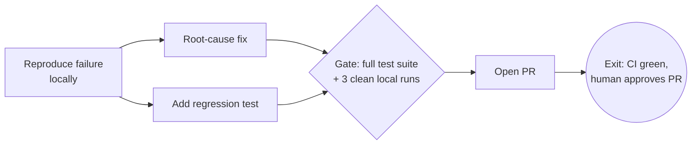

# Templates

## TASK-BRIEF.md template

Use exactly these sections. Keep it under ~120 lines — the brief is a
contract, not documentation.

```markdown
# Task Brief: <short name>

**Status:** draft | signed-off <date>
**Owner:** <human>  ·  **Agent:** <model/host that will execute>

## Goal & outcome
<One paragraph: what done looks like, why it matters, the deliverable's form
and consumer. Goal, not steps.>

Out of scope: <explicit exclusions>

## Guardrails
**Always:** <bullets>
**Ask first:** <bullets — every item here gets a gate in the loop graph>
**Never:** <bullets>

## Context map
| Source | What it is | Trust |
|--------|-----------|-------|
| <path/repo/url> | <what lives there> | authoritative / background / ignore |

Learnings write back to: <path>

## Loop graph
<mermaid diagram>

| Node | Work | Verification | Max retries | On exhaust |
|------|------|--------------|-------------|-----------|
| n1 | <bucket> | <command/check> | 3 | escalate with attempts |

## Exit criteria & budget
The task is done when ALL of the following pass:
1. <objective criterion + how it's checked>
2. <criterion>

Judge: <command / judge pass + rubric / human>
Budget: <max total iterations, and any cost/time cap>

## Open questions
- <anything unresolved — empty is the goal>
```

## Worked example — loop graph

Task: "stop the nightly import job from failing" (goal, not the literally
requested "add a retry").



| Node | Work | Verification | Max retries | On exhaust |
|------|------|--------------|-------------|-----------|
| n1 | reproduce the failure | failure observed locally with the prod input | 3 | escalate: can't reproduce |
| n2 | fix root cause | job succeeds on the failing input | 3 | escalate with attempted fixes |
| n3 | regression test | new test fails on old code, passes on new | 2 | escalate |
| g1 | gate | `pytest` green + 3 consecutive clean runs | 1 | back to n2 |
| n4 | PR | CI green | 2 | escalate with CI log |

Notes on shape:

- n2 and n3 are parallel branches — no edge between them because neither
  depends on the other's output.
- The gate g1 sits before the PR because pushing is an "ask first" guardrail
  in this brief; nothing irreversible happens on a red check.
- The exit is the Phase-1 criteria verbatim. If the human only signed off on
  "CI green", the human-approval clause wouldn't be here.

## Iteration log format

Append-only, one line per inner-loop pass, written where the human can read
it later (e.g. `LOOP-LOG.md` next to the brief):

```
| # | node | change attempted | check result | kept? |
|---|------|-----------------|--------------|-------|
| 1 | n2 | widened timeout to 30s | job still fails (DNS error) | reverted |
| 2 | n2 | pinned resolver, retry x3 | job passes failing input | kept |
```

The log is what makes an escalation useful ("here's what I tried") and what
turns a night of unattended looping into something reviewable in the morning.
